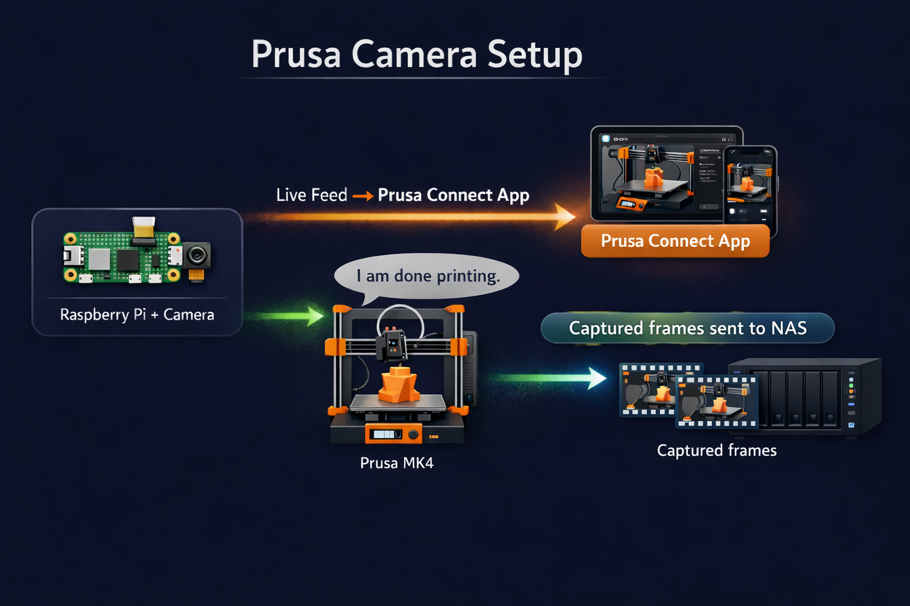

# Prusa Connect Camera + Automatic Timelapse Videos

**Live camera feed in the Prusa app + automatic timelapse videos saved to your NAS.**

A plug-and-play Raspberry Pi camera system for Prusa 3D printers that does three things:

1. **📱 Remote Monitoring** — Stream your print to the Prusa Connect app so you can check on it from anywhere
2. **🎬 Automatic Frame Capture** — Recording starts when you print, stops when done, saves frames to your NAS
3. **🎥 Automatic Video Creation** — Frames are automatically rendered into MP4 timelapse videos

---

## How It Works




---

## Automatic Video Creation

When a print finishes, the video processor automatically:

1. Detects the completed session on your NAS
2. Renders frames into an MP4 timelapse video
3. Saves the video alongside the frames folder

**Output:** High-quality H.264 video at 10 FPS (configurable), perfect for YouTube uploads.

**Recovery:** If encoding is interrupted (power loss, etc.), the system automatically detects and retries on next startup.

**Resource Usage:** Optimized for Raspberry Pi Zero 2W (512MB RAM) — video encoding runs at low priority so it doesn't interfere with frame capture or Prusa Connect uploads.

---

## Hardware You'll Need

| Component | Recommended | Notes |
|-----------|-------------|-------|
| **Raspberry Pi** | Raspberry Pi Zero 2 W | Any Pi with camera port works |
| **Camera** | Raspberry Pi Camera Module 3 | Or Camera Module 2. Both work great |
| **Power Supply** | Official Pi power supply | 5V 2.5A minimum |
| **MicroSD Card** | 16GB+ | For Raspberry Pi OS |
| **NAS** | TrueNAS, Synology, etc. | Any SMB-compatible storage |

### About the Camera

This project uses **`rpicam-still`** from the `rpicam-apps` package - the official Raspberry Pi camera software. It works with:

- **Raspberry Pi Camera Module 3** (recommended) - 12MP, autofocus
- **Raspberry Pi Camera Module 2** - 8MP, fixed focus
- **Raspberry Pi Camera Module 3 Wide** - Wider field of view
- **Raspberry Pi HQ Camera** - For advanced users

**Note:** USB webcams are NOT supported. You need a Pi camera that connects via the ribbon cable.

---

## Quick Start

### Step 1: Set Up Your Raspberry Pi

Flash Raspberry Pi OS Lite (64-bit) to your SD card using [Raspberry Pi Imager](https://www.raspberrypi.com/software/).

In the imager settings:
- Enable SSH
- Set your WiFi credentials
- Set a hostname (e.g., `prusacam`)

### Step 2: Enable the Camera

SSH into your Pi:

```bash
ssh <your-username>@<your-hostname>.local
# or use the IP address directly:
ssh <your-username>@<your-pi-ip-address>
```

> **Note:** Replace `<your-username>` with the username you set during Pi setup, and `<your-hostname>` with your Pi's hostname or IP address.

Edit the boot config:

```bash
sudo nano /boot/firmware/config.txt
```

Make sure this line exists (add it if missing):

```
camera_auto_detect=1
```

Reboot:

```bash
sudo reboot
```

### Step 3: Install Dependencies

SSH back in and run:

```bash
# Update system
sudo apt update && sudo apt upgrade -y

# Install required packages
sudo apt install -y git rpicam-apps cifs-utils smbclient python3 python3-pip

# Install TailScale (for secure NAS access)
curl -fsSL https://tailscale.com/install.sh | sh
sudo tailscale up
```

### Step 4: Clone and Run Setup

```bash
cd ~
git clone https://github.com/shreyashguptas/prusa-camera-setup.git
cd prusa-camera-setup
python3 setup.py
```

The setup wizard will guide you through:
1. Entering your Prusa Connect credentials
2. Connecting to your NAS
3. Installing the services

**That's it!** Your camera will now stream to Prusa Connect and automatically capture timelapse frames to your NAS.

---

## Getting Your Credentials

You'll need these during setup:

### From Prusa Connect (connect.prusa3d.com)

1. **Printer UUID**
   - Go to your printer's page on Prusa Connect
   - Copy the UUID from the URL: `https://connect.prusa3d.com/printers/YOUR-UUID-HERE`

2. **Camera Token**
   - On your printer's page, click "Add Camera"
   - Click "Generate" to create a new camera token (20 characters)

### From Your Printer

3. **PrusaLink API Key**
   - On your printer: Settings > Network > PrusaLink
   - Note the API key shown

4. **Printer IP Address**
   - On your printer: Settings > Network > PrusaLink
   - Note the IP address (e.g., `192.168.1.81`)

---

## Configuration

All settings are stored in `~/.prusa_camera_config`:

```ini
[prusa]
printer_uuid = your-printer-uuid
camera_token = XXXXXXXXXXXXXXXXXXXX
api_key = your_prusalink_api_key
printer_ip = your-printer-ip-address

[nas]
ip = 100.x.x.x
share = storage/printer-footage
mount_point = /mnt/nas/printer-footage
username = your_smb_user

[timelapse]
capture_interval = 30    # Seconds between frames during print
finishing_threshold = 98 # Start fast capture at this % complete
finishing_interval = 5   # Seconds between frames when finishing
post_print_frames = 24   # Extra frames after print completes
post_print_interval = 5  # Seconds between post-print frames

[camera]
width = 1704
height = 1278
quality = 85             # JPEG quality (1-100)
upload_interval = 12     # Seconds between Prusa Connect uploads

[video]
enabled = true           # Enable automatic video creation
frame_rate = 10          # Output video FPS
rotation = 180           # Rotate video (0, 90, 180, 270)
crf = 18                 # Quality (0=lossless, 18=high, 28=low)
preset = veryfast        # Encoding speed (ultrafast to veryslow)
```

To change settings, either edit this file or run `python3 setup.py` again.

---

## Services

Three systemd services run on your Raspberry Pi:

| Service | Purpose |
|---------|---------|
| `prusacam.service` | Uploads camera snapshots to Prusa Connect for remote monitoring |
| `timelapse-monitor.service` | Captures frames during prints, saves to NAS |
| `video-processor.service` | Renders completed frame sessions into MP4 videos |

### Managing Services

```bash
# Check status of all services
sudo systemctl status prusacam timelapse-monitor video-processor

# Restart a service
sudo systemctl restart video-processor

# View logs
journalctl -u video-processor -f
```

---

## Output Structure

Each print session creates a folder on your NAS:

```
/mnt/nas/printer-footage/
└── print_20260203_151949/
    ├── frames/
    │   ├── frame_000000.jpg
    │   ├── frame_000001.jpg
    │   └── ...
    ├── print_20260203_151949.mp4    # Final timelapse video
    ├── video_creation.log           # Encoding log
    └── video_complete               # Marker file (encoding done)
```

---

## License

MIT License - Feel free to use and modify.

## Contributing

Pull requests welcome! Please test on a Raspberry Pi before submitting.
